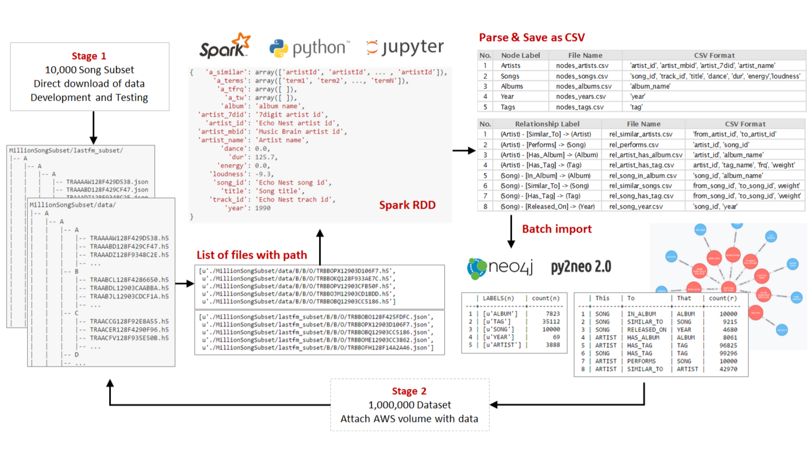

# Million Song Dataset Graph

*Andrea Soto*  
*MIDS W205 Final Project*  

---
## Project Overview

**Problem Summary:** How to store a music recommendation system

**Proposed Solution:** Model the system as a graph to make it easy to transverse relationships 

**Data:** Million Song Dataset and Last.fm dataset 

**Project Goals**: 

1. Model data as a graph
2. Implement and automate an ETL process
3. Store data in graph database

**Technologies Used:** AWS EC2 and EBS, Jupyter, Spark, Python (pyspark and py2neo libraries), Neo4j


---
## How to 

This project consists of 5 Jupyter notebooks that walk through the basic configuration, show the development and testing of code, the file structures, the data structures, script creation, and how to run the scripts.

The notebooks are ordered as follows:

- Step 1 - Configuration [link](./Step 1 - Configuration.ipynb)  
- Step 2 - Process Subset [link](./Step 2 - Process Subset.ipynb)  
- Step 3 - Load Subset to Neo [link](./Step 3 - Load Subset to Neo.ipynb)  
- Step 4 - Process Entire Dataset [link](./Step 4 - Process Entire Dataset.ipynb)  
- Step 5 - Import Entire Dataset [link](./Step 5 - Import Entire Dataset.ipynb)  

---

## Graph Model

The image below shows the graph model used.


---

## Data Flow

The data flow is summarized in the image below.



---
## Limitations

- The ETL process developed is based on the directory structure and HDF5 file format of the Million Song Dataset. If the source information has a different structure or format then the data will need to be processed differently and the current implementation would have to be adapted or changed.
- A thorough data cleaning process was not performed and some issues in the original data were preserved. For example, when a song is performed by more than one artist, the MSD names all of the artist in the 'artist' field, but chooses only one of the artist to use in identifying fields like 'artist-id'. Therefore, the data contains unique artist-ids that are linked to more than one artist name. Some examples are provided below under 'Data Inconsistencies'.
- The processed was scaled vertically by using an instance with more CPUs and not horizontally by using a cluster. For a datasets of 30 to 50 million songs, it would better to scale the process horizontally.
- The similarity relationships were taken from the datasets so the graph relies on the availability of this information in the Echo Nest and Last.fm APIs.


---

## Future Work

- Use GraphX to perform more graph analytics
- Improve the quality of the data. For example, when multiple artists collaborate on a song only one 'perform' relationship was created instead of linking all the artist to the song. There are also some id inconsistencies (unique id's for more than one artist or song)
- Add new songs, node types, or more properties by connecting to the APIs of Echo Nest, Musicbrainz, 7digital, or other music APIs
- Add nuances like mood tags, artist collaboration, song covers, live versions, etc.
- Create a model for creating similarity edges between songs and between artist
- Add user likes and run personalized Page Rank to make recommendations to users

---
## Data Inconsistencies (not cleaned)

By looking at the error log of Neo4j's import tool, I found some inconsistentcies in the node ids. Some examples are provided below.


```python
print "Same unique codes have a different artist name\n"
!awk 'NR==22' /graph/neo4j/data/import/artist-002
!awk 'NR==1718' /graph/neo4j/data/import/artist-015
!awk 'NR==1136' /graph/neo4j/data/import/artist-027
!awk 'NR==412' /graph/neo4j/data/import/artist-031
```

    Same unique codes have a different artist name
    
    ARRICQT1187FB58BA5,c61b43ad-baa8-4bde-a18f-6d5099c898d0,406480,Lydie Auvray
    ARRICQT1187FB58BA5,c61b43ad-baa8-4bde-a18f-6d5099c898d0,406480,Duck Baker
    ARRICQT1187FB58BA5,c61b43ad-baa8-4bde-a18f-6d5099c898d0,406480,Frederick Rousseau
    ARRICQT1187FB58BA5,c61b43ad-baa8-4bde-a18f-6d5099c898d0,406480,Goran Bregovic


```python
print "When artists collaborate in a songs, only one artist is tagged in the data\n"
!awk 'NR==82' /graph/neo4j/data/import/artist-009
!awk 'NR==939' /graph/neo4j/data/import/artist-013
!awk 'NR==2068' /graph/neo4j/data/import/artist-013
!awk 'NR==46' /graph/neo4j/data/import/artist-017
``
    When artists collaborate in a songs, only one artist is tagged in the data
    
    ARW5MXU1187B9A9F58,194e436d-c00a-4772-9c8e-48f7f32c95a4,260893,Anne Linnet;Mek Pek
    ARW5MXU1187B9A9F58,194e436d-c00a-4772-9c8e-48f7f32c95a4,260893,Marquis De Sade_ Anne Linnet
    ARW5MXU1187B9A9F58,194e436d-c00a-4772-9c8e-48f7f32c95a4,260893,Anne Linnet;Sanne Salomonsen
    ARW5MXU1187B9A9F58,194e436d-c00a-4772-9c8e-48f7f32c95a4,260893,Anne Linnet


When loading the data into Neo4j, only the first node will be created and any repeated nodes will be ignored. This will create errors in the Artist names and relationships. 

